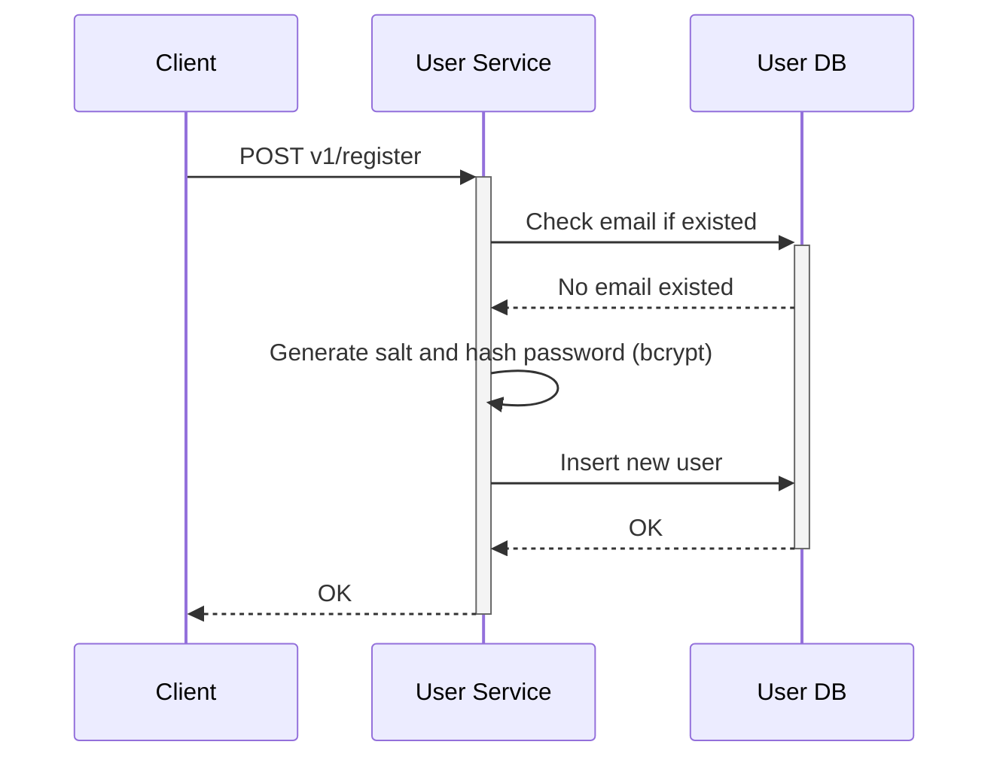
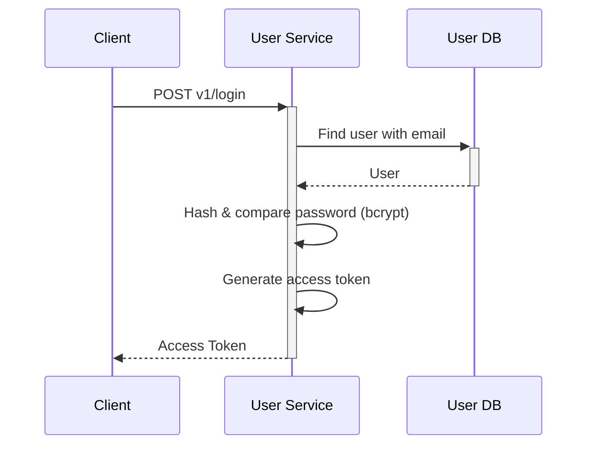
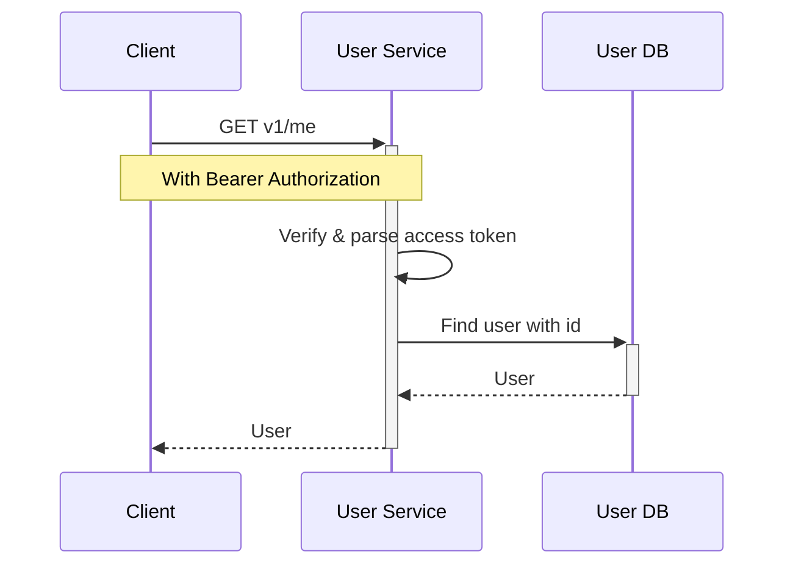
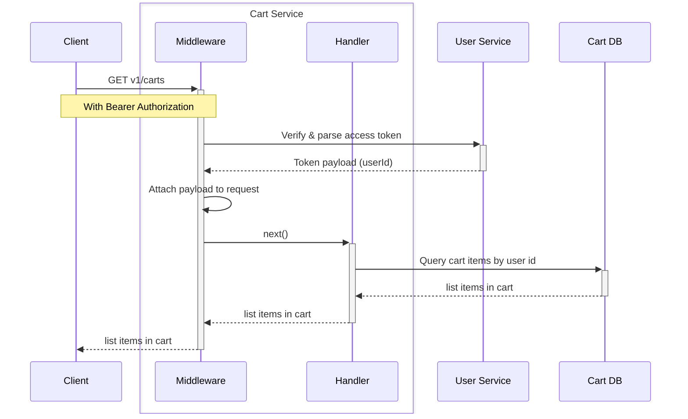

# Authentication with JWT

```bash
npm install -D @types/jsonwebtoken @types/bcrypt
npm install jsonwebtoken bcrypt
```

## 1. Registration flow



## 2. Login flow



## 3. Get user profile (My profile)



## 4. Authorization flow with middleware


